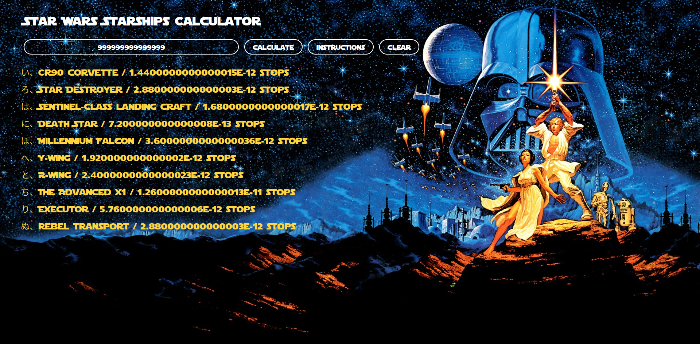

# StarWars-Starship-Calculator
StarWars API Starship Calculator problem using JavaScript, ES6, AJAX and JSON :rocket:

https://swapi.dev/  

	

#### Problem to solve:

We want to know for all SW starships, to cover a given distance, how many stops for resupply are required
The application will take as input a distance in mega lights (MGLT)
The output should be a collection of all the star ships and the total amount of stops required to make the distance between the planets

#### Documentation

1. Create a simple user-interface to interact with the API

2. Take the input from the user and connect it with the API

3. Take the data from the API, process it and show info to the user

#### 1. Create a simple user interface to interact with the API

Added original poster as a background, a div board, divided into 4 sections

-title
-input
-stats

#### 2. Connect the app with the API

Access the url https://swapi.dev/api/starships/ to access JSON data for the starships

Send JSON data to an specific function to print onto the screen

#### 3. Store and access the data

Get JSON data and store name, MGLT and consumables data into variables

- Need to know the total distance in hours a starship can cover 

- Multiply consumables results to get hours and store results on new variable 

- (new variable) totalDistance = mglt * hoursDistance

- calculateStops = totalDistance / inputDistance

Show results (name and number of stops) onto the screen

Done!
